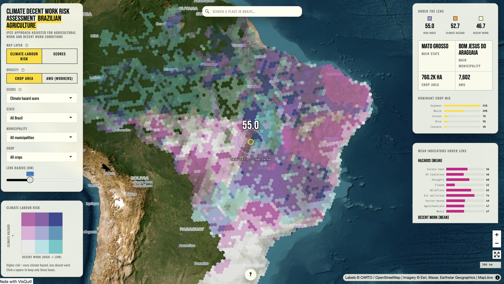

```{r}
#| label: deps
#| include: false
#| message: false
#| warning: false

# Include dependencies to track with renv here
library(fontawesome)
```

::: {.centered}


:::

Lançamos a nova visualização de Avaliação de Risco Climático e Trabalho Decente na semana passada, durante o Seminário Internacional sobre Tráfico de Seres Humanos: evidências empíricas, mensuração e novos debates teóricos.

Como funciona: apresenta os riscos climáticos e as condições de trabalho no mesmo mapa do Brasil, com resolução de 5 km. Cada célula contém uma pontuação de risco climático, uma pontuação de trabalho decente e a exposição de 117 culturas agrícolas, com base no CROPGRIDS, combinadas de acordo com a estrutura Risco = Perigo × Exposição × Vulnerabilidade do IPCC, abrangendo todos os 5.570 municípios. Ao ampliar o mapa, os hexágonos ficam mais detalhados. Ao arrastar a lente, é possível visualizar o que está abaixo dela.

O projeto, a metodologia e os dados estão todos no relatório: [https://zenodo.org/records/18839272](https://zenodo.org/records/18839272)

Cada célula de 5 km contém uma pontuação de risco climático (23 indicadores em 9 grupos — calor, radiação UV, seca, inundação, incêndio florestal, poluição do ar, doenças transmitidas por vetores, agrotóxicos, WASH), uma pontuação de trabalho decente (35 indicadores distribuídos entre os 10 elementos do trabalho decente da OIT) e a exposição de 117 culturas agrícolas, com base no [CROPGRIDS](https://www.nature.com/articles/s41597-024-03247-7). Os três indicadores são combinados seguindo a estrutura Risco = Perigo × Exposição × Vulnerabilidade do IPCC, abrangendo todos os 5.570 municípios. Do projeto Clidewo: Mudanças Climáticas, Trabalho Decente e Saúde dos Trabalhadores na Agricultura Brasileira.

{.lightbox fig-align="center"}
</br>
### Link:
</br>
[https://tool.clidewo.com](https://tool.clidewo.com)

::: {.column-page}


```{=html}


```
:::


---


#### Compartilhe nas redes sociais:

```{=html}
<!-- AddToAny BEGIN -->
<div class="a2a_kit a2a_kit_size_32 a2a_default_style" data-a2a-icon-color="#FFDC02,black">

<a class="a2a_button_email a2a_counter"></a>
<a class="a2a_button_copy_link a2a_counter"></a>
<a class="a2a_button_linkedin a2a_counter"></a>
<a class="a2a_button_facebook a2a_counter"></a>
<a class="a2a_button_bluesky a2a_counter"></a>
<a class="a2a_button_x a2a_counter"></a>
<a class="a2a_button_threads a2a_counter"></a>
<a class="a2a_button_mastodon a2a_counter"></a>
<a class="a2a_button_whatsapp a2a_counter"></a>
<a class="a2a_dd a2a_counter" href="https://www.addtoany.com/share"></a>
</div>
<script async src="https://static.addtoany.com/menu/page.js"></script>
<!-- AddToAny END -->
```
