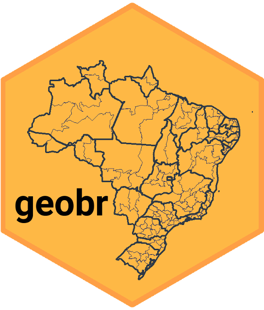
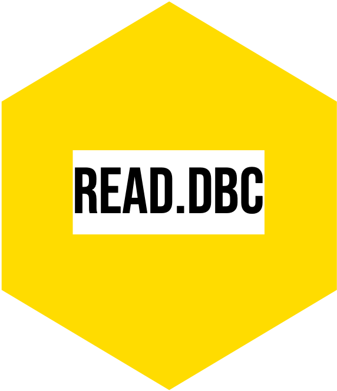

```{r}
#| label: deps
#| include: false
#| message: false
#| warning: false
```

:::{.column-body-outset}

```{css, echo = FALSE}
.justify {
  text-align: justify !important
}
```

::: {.justify}

	
## Data science tools and R packages

Code for Climate Decent Work Vulnerability Assessment (CRVA) integration will be included soon to facilitate reproducibility of the project.

We are grateful for the previous work that facilitates the replicability of research. Analysis is conducted with the following R packages:


:::

 
<!--
:::{#logo-r-packages layout-ncol=10}
[](https://www.econ.puc-rio.br/datazoom/english/dz_R.html){fig-align="center" width="100%"}

[](https://github.com/ipeaGIT/geobr){fig-align="center" width="100%"}

[](https://ipeagit.github.io/censobr/){fig-align="center" width="100%"}

[](https://github.com/danicat/read.dbc){fig-align="center" width="100%"}

[](https://cran.r-project.org/web/packages/sidrar/vignettes/Introduction_to_sidrar.html){fig-align="center" width="100%"}
:::
-->

::: {.column-screen}
```{=html}

<iframe src="hexout.html"
        style="width:100%; height:500px; border:none;">
</iframe>
```
:::

#### Share it on social media:

```{=html}
<!-- AddToAny BEGIN -->
<div class="a2a_kit a2a_kit_size_32 a2a_default_style" data-a2a-icon-color="#FFDC02,black">

<a class="a2a_button_email a2a_counter"></a>
<a class="a2a_button_copy_link a2a_counter"></a>
<a class="a2a_button_linkedin a2a_counter"></a>
<a class="a2a_button_facebook a2a_counter"></a>
<a class="a2a_button_bluesky a2a_counter"></a>
<a class="a2a_button_x a2a_counter"></a>
<a class="a2a_button_threads a2a_counter"></a>
<a class="a2a_button_mastodon a2a_counter"></a>
<a class="a2a_button_whatsapp a2a_counter"></a>
<a class="a2a_dd a2a_counter" href="https://www.addtoany.com/share"></a>
</div>
<script async src="https://static.addtoany.com/menu/page.js"></script>
<!-- AddToAny END -->
```


