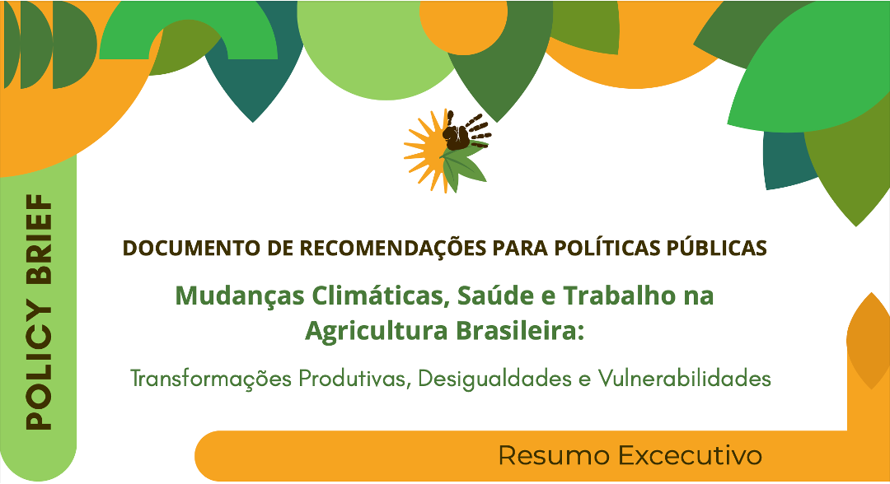

This brief was prepared based on the findings of the field research and the content produced in the National Workshop on Climate Change, Work and Health in Agriculture, in which health and work-related issues were identified. Such issues constrain the guarantee and proper exercise of workers’ human rights, in addition to being harmful to the environment. In the following, the main points of discussion and corresponding recommendations are presented, aimed at creating and refining public policies that effectively integrate health care, labour, and the environment, while also identifying potential actors responsible for their coordination and implementation.





### Download {.appendix}




#### Share it on social media:

```{=html}
<!-- AddToAny BEGIN -->
<div class="a2a_kit a2a_kit_size_32 a2a_default_style" data-a2a-icon-color="#FFDC02,black">

<a class="a2a_button_email a2a_counter"></a>
<a class="a2a_button_copy_link a2a_counter"></a>
<a class="a2a_button_linkedin a2a_counter"></a>
<a class="a2a_button_facebook a2a_counter"></a>
<a class="a2a_button_bluesky a2a_counter"></a>
<a class="a2a_button_x a2a_counter"></a>
<a class="a2a_button_threads a2a_counter"></a>
<a class="a2a_button_mastodon a2a_counter"></a>
<a class="a2a_button_whatsapp a2a_counter"></a>
<a class="a2a_dd a2a_counter" href="https://www.addtoany.com/share"></a>
</div>
<script async src="https://static.addtoany.com/menu/page.js"></script>
<!-- AddToAny END -->
```
