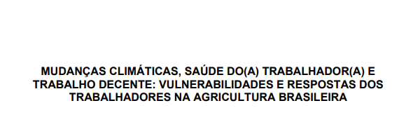

O projeto emprega uma abordagem de métodos mistos que combina a análise de dados secundários (registros de vigilância sanitária, estatísticas trabalhistas e indicadores climáticos) com dados primários provenientes de 79 entrevistas de campo e uma oficina nacional multissetorial. Essa metodologia integrada proporciona uma avaliação abrangente dos riscos climáticos e seus efeitos sobre os trabalhadores, examinados sob a perspectiva do trabalho decente. Três linhas de trabalho complementares – abordagens participativas, análise de dados secundários e engajamento das partes interessadas – convergem para produzir uma Avaliação de Riscos Climáticos e Trabalho Decente em nível municipal em todo o Brasil e um conjunto de recomendações para promover respostas intersetoriais às mudanças climáticas, integrando políticas de saúde, trabalho, meio ambiente e agricultura.

Este documento faz parte do projeto Mudanças Climáticas, Saúde dos Trabalhadores e Trabalho Decente: vulnerabilidades e respostas dos trabalhadores na agricultura brasileira, que visa analisar os impactos das mudanças climáticas no contexto do trabalho agrícola. As atividades foram realizadas por meio da cooperação interinstitucional entre a Universidade de Nottingham (Reino Unido), a Universidade Federal Fluminense (UFF), a Universidade Federal do Maranhão (UFMA) e a Universidade Federal do Mato Grosso (UFMT), e foram financiadas pela Academia Britânica no âmbito do Programa de Bolsas de Pesquisa Orientadas a Desafios da AOD 2024.




### Download  {.appendix}

[https://zenodo.org/records/18839272](https://zenodo.org/records/18839272) *(English version)*
*(Portuguese version soon)*

### Citation

Rodríguez-Huerta, E., Domingos Martinez dos Santos, I., de Almeida Moura, F., Faria Leal, C. R., Landman, T., Castillero, I. T. A., Coutinho, K. G., Moraes, L., Pavia, L. R., Manuella Gallego, Soares, M. R., Brandão, M. P. F., Barros Costa, S., Siviero, A. A., Trevizan, A. F., & Galvão Gomes, P. I. (2026). Climate Change, Decent Work, and Workers' Health: Vulnerabilities and Responses of Workers in Brazilian Agriculture (1.0). Zenodo. https://doi.org/10.5281/zenodo.18839272


#### Share it on social media:

```{=html}
<!-- AddToAny BEGIN -->
<div class="a2a_kit a2a_kit_size_32 a2a_default_style" data-a2a-icon-color="#FFDC02,black">

<a class="a2a_button_email a2a_counter"></a>
<a class="a2a_button_copy_link a2a_counter"></a>
<a class="a2a_button_linkedin a2a_counter"></a>
<a class="a2a_button_facebook a2a_counter"></a>
<a class="a2a_button_bluesky a2a_counter"></a>
<a class="a2a_button_x a2a_counter"></a>
<a class="a2a_button_threads a2a_counter"></a>
<a class="a2a_button_mastodon a2a_counter"></a>
<a class="a2a_button_whatsapp a2a_counter"></a>
<a class="a2a_dd a2a_counter" href="https://www.addtoany.com/share"></a>
</div>
<script async src="https://static.addtoany.com/menu/page.js"></script>
<!-- AddToAny END -->
```
