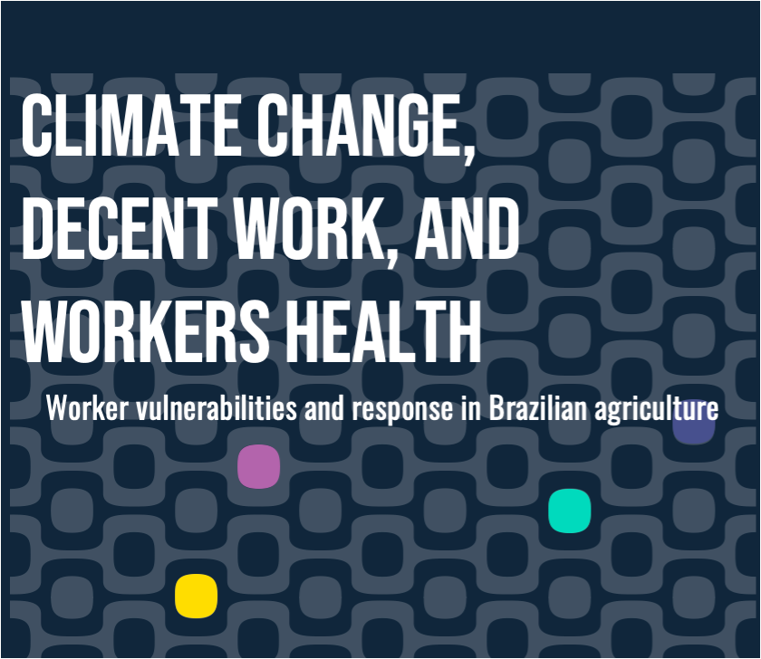
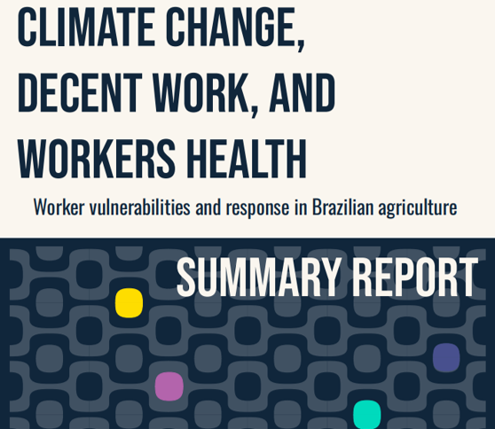

The project employs a mixed-methods approach that combines secondary data analysis (health surveillance records, labour statistics, and climate indicators) with primary data from 79 field interviews and a national multi-stakeholder workshop. This integrated methodology provides an extensive assessment of climate hazards and their effects on workers, examined through a decent work lens. Three complementary workstreams – participatory approaches, secondary data analysis, and stakeholder engagement – converge to produce a Climate-Decent Work Risk Assessment at municipal level across Brazil and a set of recommendations to promote intersectoral responses to climate change integrating health, labour, environment, and agriculture policies.

This document is part of the project Climate Change, Workers’ Health, and Decent Work: vulnerabilities and responses of workers in Brazilian agriculture, which aims to analyse the impacts of climate change within the context of agricultural work. The activities were carried out through inter-institutional cooperation between the University of Nottingham (UK), Fluminense Federal University (UFF), Maranhão Federal University (UFMA) and Mato Grosso Federal University (UFMT), and were funded by The British Academy under the ODA Challenge-Oriented Research Grants 2024 Programme.




The report is available in full for those who would like to explore the analysis in detail, along with a short summary outlining the key results and recommendations.





### Download  {.appendix}

Access to full and sumary versions: [https://zenodo.org/records/18839272](https://zenodo.org/records/18839272)


### Citation

Rodríguez-Huerta, E., Domingos Martinez dos Santos, I., de Almeida Moura, F., Faria Leal, C. R., Landman, T., Castillero, I. T. A., Coutinho, K. G., Moraes, L., Pavia, L. R., Manuella Gallego, Soares, M. R., Brandão, M. P. F., Barros Costa, S., Siviero, A. A., Trevizan, A. F., & Galvão Gomes, P. I. (2026). Climate Change, Decent Work, and Workers' Health: Vulnerabilities and Responses of Workers in Brazilian Agriculture (1.0). Zenodo. https://doi.org/10.5281/zenodo.18839272


#### Share it on social media:

```{=html}
<!-- AddToAny BEGIN -->
<div class="a2a_kit a2a_kit_size_32 a2a_default_style" data-a2a-icon-color="#FFDC02,black">

<a class="a2a_button_email a2a_counter"></a>
<a class="a2a_button_copy_link a2a_counter"></a>
<a class="a2a_button_linkedin a2a_counter"></a>
<a class="a2a_button_facebook a2a_counter"></a>
<a class="a2a_button_bluesky a2a_counter"></a>
<a class="a2a_button_x a2a_counter"></a>
<a class="a2a_button_threads a2a_counter"></a>
<a class="a2a_button_mastodon a2a_counter"></a>
<a class="a2a_button_whatsapp a2a_counter"></a>
<a class="a2a_dd a2a_counter" href="https://www.addtoany.com/share"></a>
</div>
<script async src="https://static.addtoany.com/menu/page.js"></script>
<!-- AddToAny END -->
```
