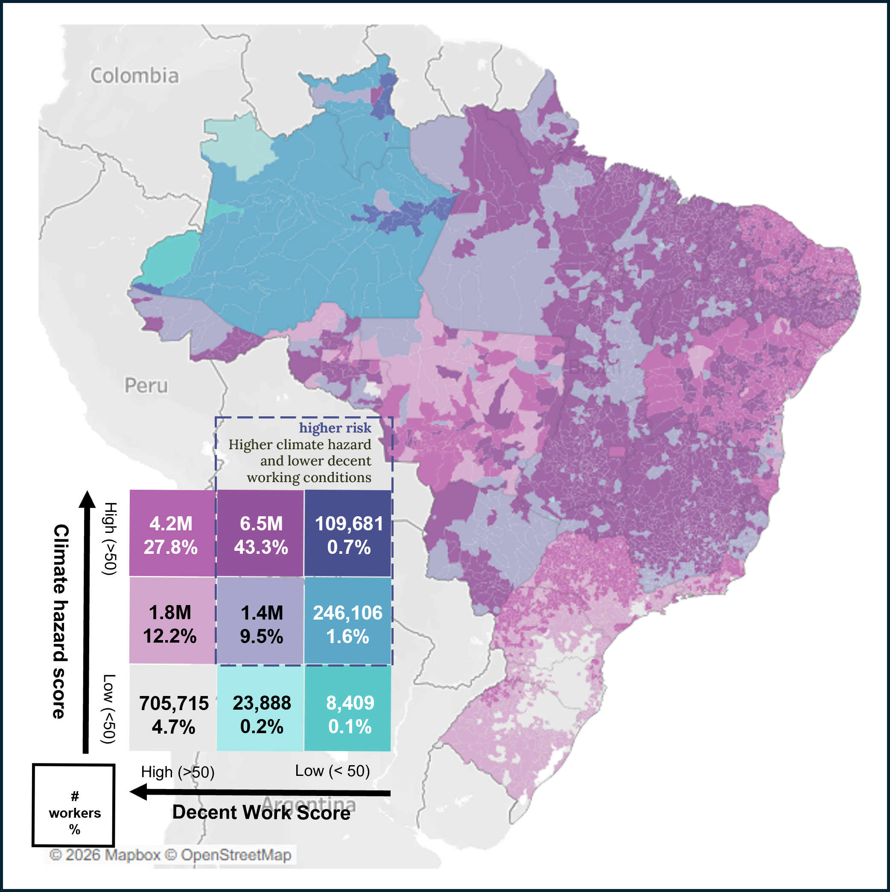

```{r}
#| label: deps
#| include: false
#| message: false
#| warning: false

# Include dependencies to track with renv here
library(fontawesome)
```

Output data from report: Climate Change, Decent Work and Workers' Health (Section IV).

Dataset contains:

This dataset provides integrated indicators for a Climate-Decent Work Risk Assessment of rural agricultural workers in Brazil. It covers all 5,570 Brazilian municipalities and a harmonised spatial grid at 0.05-degree
(~5.5 km) resolution.

The dataset integrates three analytical pillars following the IPCC framework (Risk = Hazard × Exposure × Vulnerability):

(1) **CLIMATE HAZARD SCORE** — A composite index combining 23 indicators from 7 international datasets into 9 hazard groups: Excessive Heat, UV Radiation, Droughts, Floods, Wildfires, Air Pollution, Vector-borne Diseases, Agrochemicals, and WASH. Indicators are normalised to 0–100 and weighted using expert priors adjusted by Data Quality Assessment (DQA) scores.
Primary sources: CCVI v2.0, Global Inequalities in Environmental Conditions, TEMIS UV, ThinkHazard! (World Bank), AdaptaBrasil (MCTI), IDSC-BR 2025, Tang et al. pesticide risk.

(2) **AGRICULTURAL EXPOSURE** — Crop harvested area and crop area per municipality× crop type (~113 crops) from CROPGRIDSv1.08 (not included in the dataset). Total worker by demographics from IBGE agricultural census activity classes.

(3) **DECENT WORK SCORE** — A composite index of 35 indicators organised
into 10 ILO Decent Work elements, including employment opportunities, adequate earnings, working time, equality of opportunity, forced labour, occupational safety, and social security. Derived from PNADC (2021–2024), IDSC-BR 2025, IPS Brasil, SINAN, and CPT forced-labour rescue data. Bayesian shrinkage estimators stabilise state-level PNADC estimates.





All datasets are linkable via the IBGE 7-digit municipality code (CD_MUN). The primary files are provided in Excel formats.


Access: [https://zenodo.org/records/18828568](https://zenodo.org/records/18828568)

---

#### Share it on social media:

```{=html}
<!-- AddToAny BEGIN -->
<div class="a2a_kit a2a_kit_size_32 a2a_default_style" data-a2a-icon-color="#FFDC02,black">

<a class="a2a_button_email a2a_counter"></a>
<a class="a2a_button_copy_link a2a_counter"></a>
<a class="a2a_button_linkedin a2a_counter"></a>
<a class="a2a_button_facebook a2a_counter"></a>
<a class="a2a_button_bluesky a2a_counter"></a>
<a class="a2a_button_x a2a_counter"></a>
<a class="a2a_button_threads a2a_counter"></a>
<a class="a2a_button_mastodon a2a_counter"></a>
<a class="a2a_button_whatsapp a2a_counter"></a>
<a class="a2a_dd a2a_counter" href="https://www.addtoany.com/share"></a>
</div>
<script async src="https://static.addtoany.com/menu/page.js"></script>
<!-- AddToAny END -->
```
